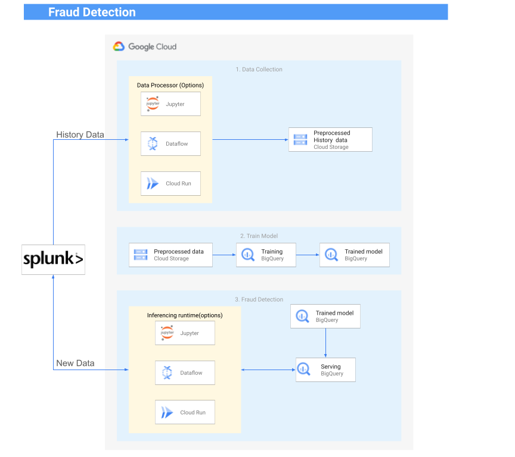

### Fraud(Anomaly) Detection with Splunk 

### Results

_might take few seconds to load the media_


### Generate some data
```bash 
# start_date = '2023-01-01'
# end_date = '2023-03-31'
python datagen.py
```
### Load generated data to BigQuery


### Create Model for Anomaly Detection in BigQuery

Execute the ```create_model.sql``` script in BigQuery

### Geneerate some more data that will be ingested to Splunk
```bash 
# start_date = '2023-04-01'
# end_date = '2023-04-3'
python datagen.py
```

### Start ingesting generated data to Splunk using REST APIs
```bash 
python splunk-ingest.py
# This ingest to main index
# this will ingest one record every 5 seconds
```

### Use Model to detect anomalies on new data
While splunk-ingest.py is running, Open ```Splunk.ipynb``` and run the cells.
``` 
 0. Create index named 'anomalies' in Splunk and update the token in the notebook
 1. Create a Search Job and Get SID from Splunk ( adjust time range in the notebook)
 2. Get Results for the SID
 3. Detect Anomaly using our trained model inBigQuery 
 4. Post new detected anomalies to Splunk
``````
Results


